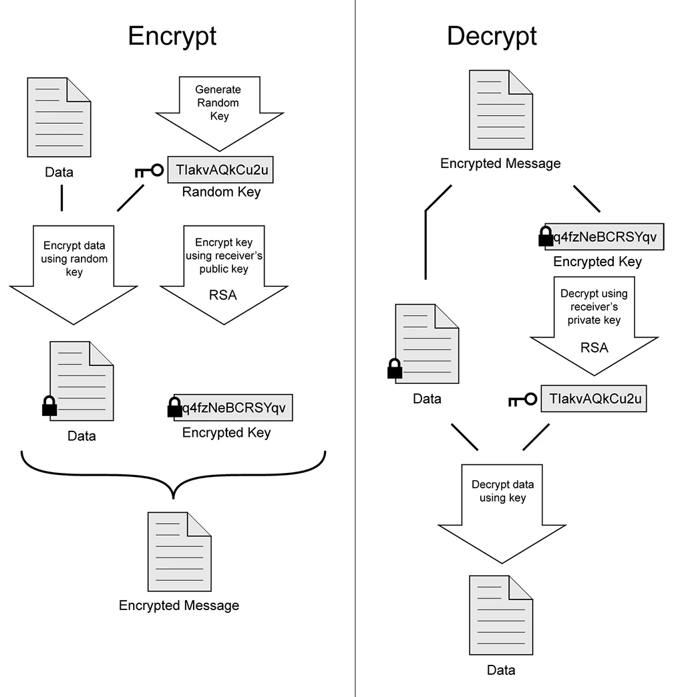
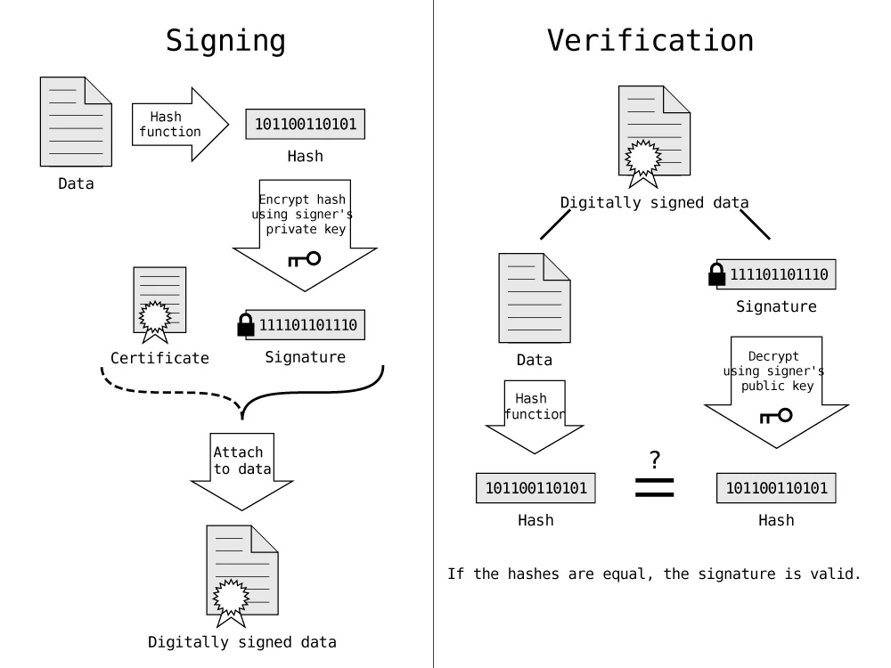

TODO: GPG

# 1. GPG基本说明

## 1.1. 基本概念

- GPG
  - 就是 GnuPG 就是 GNU Privacy Guard，是一款自由软件。
  - 我们用它完成各种具体操作：生成密钥对、签名／验证、加密／解密。

- OpenPGP
  - 是一套开放的互联网标准。
  - GPG 是这套标准的实现。
  - OpenPGP 有一套信任体系：Web of Trust（信任网络）。
  - OpenPGP 有一套开放的公钥服务器池：SKS Keyservers，用户可以自由上传自己的公钥。

如今最早的商业软件 PGP（Pretty Good Privacy）只活在维基百科中，几乎所有 PGP 都指的是 OpenPGP。

## 1.2. GPG key 信息组成

- Key ID: 该 GPG Key 的唯一标识，值为主公钥的指纹，支持多种格式(Fingerprint, Long key ID, Short key ID)，更多参见：[What is a OpenPGP/GnuPG key ID?](https://superuser.com/questions/769452/what-is-a-openpgp-gnupg-key-id)。
- UID: 1 个或多个，每个 UID 由 name、email、comment 组成，email 和 comment 可以为空。
- Expire: 过期时间，可以为永久。
- 多个具有不同用途的非对称加密算法中的 Key 的集合。

  | 类型   | 全名          | 缩写 | 用途 (Usage) | 说明                                                              |
  | ------ | ------------- | ---- | ------------ | ----------------------------------------------------------------- |
  | 主私钥 | Secret Key    | sec  | SC           | 每个 GPG Key 有且只有一个 主私钥，可以选择一种或多种 Usage        |
  | 主公钥 | Public Key    | pub  | SC           | 每个 GPG Key 有且只有一个 主公钥，可以选择一种或多种 Usage        |
  | 子私钥 | Secret Subkey | ssb  | S/A/E        | 每个 GOG Key 可以有多个子私钥，每个子私钥可以选择一种或多种 Usage |
  | 子公钥 | Public Subkey | sub  | S/A/E        | 每个 GOG Key 可以有多个子公钥，每个子公钥可以选择一种或多种 Usage |

  - 主秘钥和主公钥（Primary Key）、子秘钥和子公钥（Sub Key）都是成对出现的，其用途也是一致的。
  - 每一对都包含一个 key id 属性（为 public key 的指纹），其中主密钥/主公钥的 key id 就是当前 GPG Key 的 Key ID。
  - 上面提到的用途，如下表所示：

    | 缩写 | 全名           | 用途                                                 |
    | ---- | -------------- | ---------------------------------------------------- |
    | C    | Certificating  | 管理证书，如添加/删除/吊销子密钥/UID，修改过期时间。 |
    | S    | Signing        | 签名，如文件数字签名、邮件签名、Git 提交。           |
    | A    | Authenticating | 身份验证，如登录。                                   |
    | E    | Encrypting     | 加密，如文件和文本。                                 |

- 注意具有 `C` 的密钥是主密钥，只有这个密钥可以用于：
  - 添加或吊销子密钥的用途
  - 添加、更改或吊销密钥关联的身份（UID）
  - 添加或更改本身或其他子密钥的到期时间
  - 为了网络信任目的为其它密钥签名

- GPG Public Key 说明如下：
  - 在非对称加密中的的公钥，公钥是需要公开发布的。
  - 同样的 GPG Public Key 也需要公开发布，但 GPG Public Key 由如下内容组成：
    - 主公钥和所有子公钥的 有效期和吊销信息 与 所有 UID 信息。
  - GPG Public Key 会使用 GPG 的主秘钥进行签名，以防止公钥被篡改。
  - 删除和吊销 GPG Public Key 中的 Sub Key 和 UID。
    - 删除，
      - 针对已公开的 GPG Public Key，如果其他人已经加载了这个 GPG Public Key。则这个删除将不会生效
      - （原因是：GPG 在更新一个 GPG Public Key 是合并操作，因此删除是无效的），如果没有公开过，则删除生效。
    - 吊销。
      - 标记 GPG Public Key 中 Public Subkey / UID，将添加一个“吊销”标记，
      - 这样如果其他人已经加载了这个 GPG Public Key，只要更新了，就会知道该 Public Subkey / UID 不可用了

# 2. GPG密钥作用

## 2.1. 密钥作用分类

| 缩写 | 全名           | 用途                                       |
| ---- | -------------- | ------------------------------------------ |
| C    | Certificating  | 认证，如子密钥或证书，类似根证书的作用。   |
| S    | Signing        | 签名，如文件数字签名、邮件签名、Git 提交。 |
| A    | Authenticating | 身份验证，如登录。                         |
| E    | Encrypting     | 加密，如文件和文本。                       |

**GPG 密钥的能力中， `[C]`、`[S]`、`[A]` 均属于签名方案，只有 `[E]` 是加密方案。**

- 加密过程中
  - 别人用你的公钥加密数据后发给你；
  - 这些数据只有你的私钥能解密。
- 签名过程中
  - 你先用摘要算法（例如 SHA-256）给数据提取出一个指纹（摘要、哈希值）
  - 你用私钥，把这串哈希值加密，得到一个数字签名，和文件一起发出去
  - 别人收到文件＋签名后，先计算文件的哈希值
  - 别人用你的公钥，从数字签名中解密出你给的哈希值，和他计算的对比，如果两者一致，那么签名就是有效的

加密和签名两个过程中，私钥的作用是相反的

- 加密方案中的私钥：用于解密信息
- 签名方案中的私钥：用于加密信息

注意： **公私钥是可互换的**

- 数学上来讲，它们是等价的，可以角色互换。
- 一个加密另一个就能解密。
- 但是！在具体的算法实现上，两者有很大不同。
- 我们要保证加密-解密的高效，同时保证抗破解的安全。
- 实际应用中的私钥与公钥生成，算法设计上是有偏向的。
- 这也是为什么 GPG 会为密钥分出不同用途，用户方便，算法设计者也方便。

## 2.2. 主密钥与子密钥

### 2.2.1. 目的

- 子密钥是一种自动关联而相对独立于主密钥的密钥，其能够独立于主密钥单独使用，代替主密钥进行签名/加密操作。
- 并在仅子密钥私钥泄露的情况下，可以使用主密钥吊销子密钥，而减少私钥泄露对密钥的信任损害，
- 当然，只是一般使用的话，此步骤可以跳过。默认生成的密钥够用了。

### 2.2.2. 区别

在“主密钥”和“子密钥”之间没有技术上的区别。

- 在创建时，我们赋予每个密钥特定的能力来分配功能限制。
- 一个 PGP 密钥有四项能力
- 一个密钥可能有多种能力
- 带有 `[C]` （认证）能力的密钥被认为是“主”密钥，因为它是唯一可以用来表明与其他密钥关系的密钥。

只有 `[C]` 密钥可以被用于：

- 添加或撤销其他密钥（子密钥）的 S/E/A 能力
- 添加、更改或撤销密钥关联的身份（uid）
- 添加或更改本身或其他子密钥的到期时间
- 为了网络信任目的为其它密钥签名
- 在自由软件的世界里，`[C]` 密钥就是你的数字身份。一旦你创建该密钥，你应该格外小心地保护它并且防止它落入坏人的手中。

### 2.2.3. 子密钥使用注意

当拥有多个相同功能的子密钥时

- 需要注意的是，如果用户ID所匹配的密钥组中存在多个具有"E"(加密/解密)功能的(子)密钥，
- 那么使用ID加密时只能使用最近创建的具有"E"功能的子密钥解密。
- 如果本地不存在对应的(子)私钥，即使有主私钥或其他子私钥也无法解密。

因此，如果不同的设备存放的解密子密钥不同的话，在收到别人的加密文件时，解密可能会很麻烦。

所以，可以要求发件方使用指定密钥ID来进行加密。(虽然发件人不一定会听，因为这会增加发件方的步骤。)

## 2.3. 基本原理

### 2.3.1. OpenPGP的加密与解密原理

OpenPGP加密过程：

- 随机生成一个的Key，并通过对称加密算法使用这个Key加密数据，
- 通过非对称加密算法（RSA）用接收者的公钥加密前者的Key，得到加密的数据。

### 2.3.2. OpenPGP的数字签名

数字签名是OpenPGP的重要组成部分，数字签名是一个数学过程，与现实世界的签名功能相似，但更严谨、更安全且容易验证。数字签名保证了以下情况：

- 验证发送者身份：确认发送者确实是他声称的身份。
- 完整性：文件/邮件传输过程中未被更改。
- 不可否认：发送者不可否认已发送的文件/邮件。

数字签名的原理：

- 发送者先通过加密散列函数获取数据的哈希，然后使用发送者的私钥加密哈希，得到数字签名。
- 接收者使用发送者的公钥解密数字签名得到一个哈希，并与自己计算的数据的哈希值对比，一致则数字签名有效且数据完整。

### 2.3.3. OpenPGP的公钥发布与吊销证书

我们知道公钥用于加密，可以公开发布，公钥可以点对点发送，也可以上传到密钥服务器。

需要格外注意的是公钥中包含邮箱信息，如果你将公钥发布到密钥服务器（各个公钥服务器会互相同步），那么你将永远无法从密钥服务器上删除你的公钥信息。

在某天你忘记密码口令或丢失私钥，你想要从密钥服务器上吊销你的公钥，唯一的补救措施是：你事先生成了吊销证书，使用吊销证书可以吊销公钥证书，使公钥其显示“吊销”字样，**但依然无法从密钥服务器上删除公钥信息！所以务必要谨慎上传公钥，务必生成吊销证书备用！**

### 2.3.4. 其他

**Q：数字签名为什么使用私钥加密？**

A：通常我们对非对称加密算法的工作方式的理解是公钥加密、私钥解密，这种理解是正确的，但只是对于加密数据/消息。在数字签名中则相反，私钥是数字签名的信任源（签名者是唯一拥有私钥的人），如果使用公钥签名很明显是不可行的。

**Q：私钥可以加密吗？**

A：公钥和私钥是互相工作的，即其中一个加密另个一则可以解密。公钥加密、私钥解密，私钥解密、公钥解密，这便是非对称加密的本质。

**Q：密钥长度对加密速度的影响？**

A：在RSA（非对称加密算法）中，加密的模数通常是2次方，解密的模数通常是3次方，这意味着如果将密码长度增加一倍（比如从2048增加至4096），加密成本增加4倍，解密成本增加8倍，但在现在计算机的算力下，这只是毫秒级别的差别。笔者为了验证这一理论，亲测了用2048位和4096位的密钥加密了一个1GB的文件，所需时间基本一致（70秒左右）。

**Q：密钥长度是不是越长越好？**

A：这是一个保持前瞻的安全性与足够安全之间的选择，目前RSA破解记录为768位，1024位密钥正处于危险的边缘，而2048位的密钥已经足够安全。在OpenPGP的实践中，通常建议创建一个专门用于加密的子密钥，主密钥选用4096位，而用于加密的子密钥可以使用2048位，当然，如果你想保持前瞻的安全性，使用4096位的密钥没有任何问题

# 3. 密钥体系

## 3.1. Web of Trust （WOT）

- PGP 使用了一种信任委托机制叫“Web of Trust”。
- 它的核心是尝试替代 HTTPS/TLS 世界中对集中式认证机构的需求。
- PGP 把这个责任交给了每个用户，而不是各种软件开发商来决定谁应该是你的可信认证实体。

## 3.2. Trust on First Use (TOFU)

不幸的是，很少有人理解 Web of Trust 的是如何工作的，能使用它的人更少。
它仍然是 OpenPGP 规范的一个重要方面，但 GnuPG 的近期版本（2.2 及以上）已经实现了一种替代机制叫“Trust on First Use”(TOFU)。

你可以把 TOFU 当作类似 SSH 的信任方式。

- 使用 SSH，当你第一次连接到远程系统，它的密钥指纹会被记录和保存。
- 如果将来密钥改变，SSH 客户端将会提醒你并拒绝连接，迫使你决定是否信任已改变的的密钥。

## 3.3. TLS 证书的 CA

SSL 和 TLS 的区别在于，前者是 Netscape 搞的，后者是 IETF 标准化之后改进的版本。
CA 证书和 TLS 证书不是一回事啊。CA 即 certificate authority，是证书颁发机构。你信任 CA 的证书，就信任了这个 CA 颁发的所有证书。对于常见的网络协议中的认证（HTTP、FTP、SMTP、POP、IMAP、XMPP 等等的加密版）来说，它们的证书最重要的是用于确认你连接的目标确定拥有那个域名（DV 证书），或者确实是你想要连接的机构（OV 和 EV 证书）。不过 OV 证书你必须手动去查看，EV 证书会显示机构名称，然而当你看到的时候连接已经建立、数据已经传输了。当然 TLS 还会保证数据的私密性和完整性，不过这两点不需要证书的参与。
TLS 的非对称加密用于握手阶段。双方会推导出一个临时的会话密钥用于加密数据，而这个加密是对称的。这就是为什么你看到的 TLS 加密方法那么长一串，它描述了是怎么握手的，用什么非对称加密和什么对称加密算法。

TLS 通常是交互式的（双方建立连接然后对话），而 PGP 都是非交互式的，像信件那样丢给对方就完事了。不过也有基于证书的加密/签名方案 S/MIME，详情我不了解。

# 4. 参考资料

- **[gpg使用介绍与配置说明](https://blog.logc.icu/post/2020-08-02_09-39/)**
- [OpenPGP（PGP/GPG）深入浅出，完全入门指南](https://www.rmnof.com/article/openpgp-gnupg-introduction/)
- [理解和使用 GPG](https://www.rectcircle.cn/posts/understand-and-use-gpg/)
- [GPG 入门教程](https://blog.zhanganzhi.com/zh-CN/2022/06/1c71f69657ed/)
- [用 PGP 保护代码完整性 - linux.cn](https://linux.cn/article-10432-1.html)
- [个人使用如何选择GnuPG密钥方案？使用子密钥还是不用？](https://bbs.archlinuxcn.org/viewtopic.php?id=9906)
- [GPG应用指南](https://zhuanlan.zhihu.com/p/21267738)
- [subkey's public key is the same as master's public key?](https://unix.stackexchange.com/questions/486084/gpg-e-subkeys-public-key-is-the-same-as-masters-public-key)
